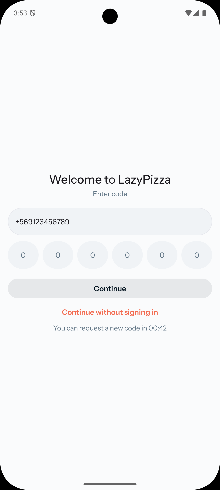
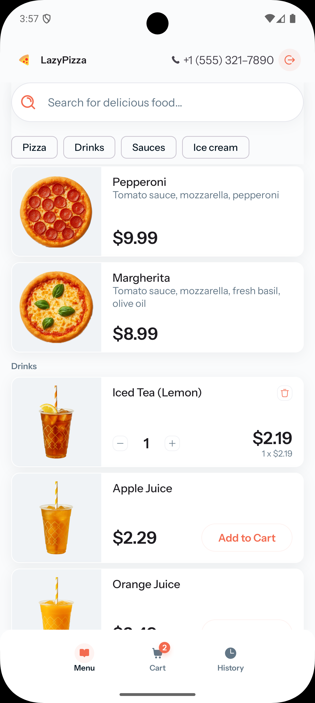
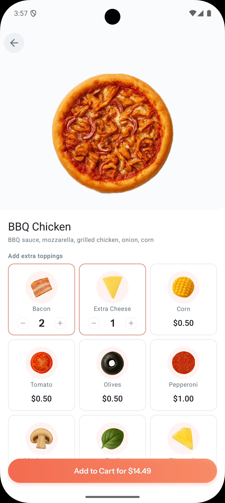
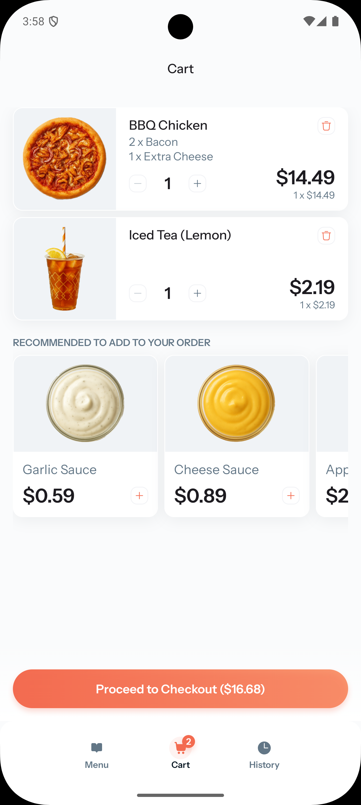
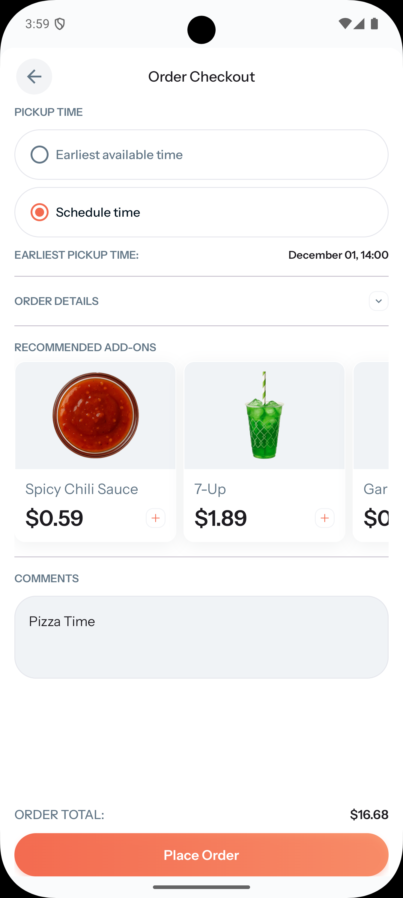
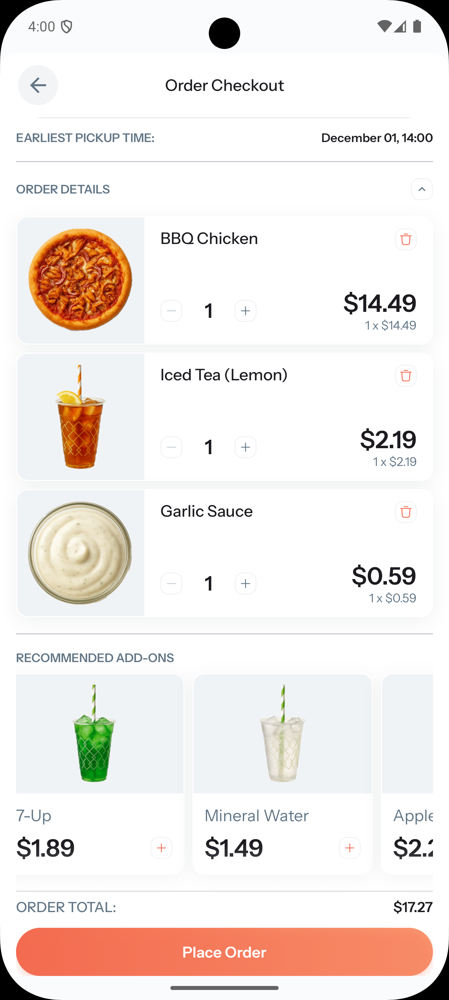
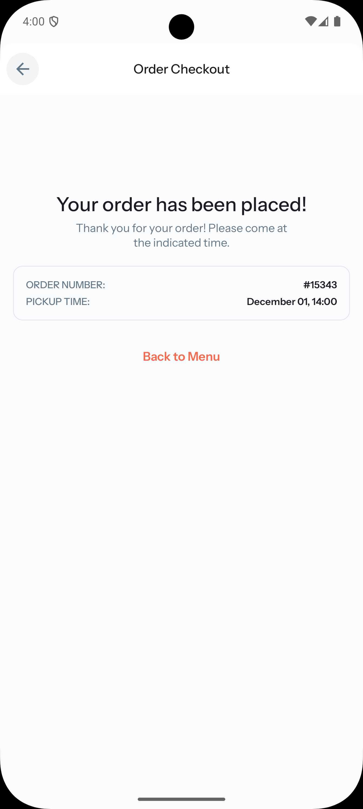
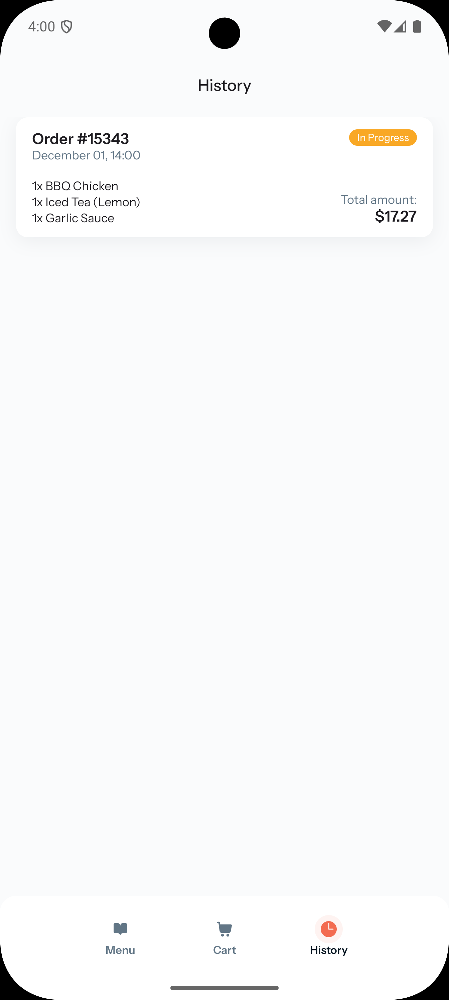

# LazyPizza

A modern Android pizza ordering application built with Jetpack Compose and Clean Architecture
principles for Mobile Dev Campus.

## Features

- User authentication with phone verification
- Browse pizza products, drinks, and sauces
- Customizable pizzas with extra toppings
- Shopping cart with recommended add-ons
- Order checkout with pickup time scheduling
- Order history tracking
- Modern Material Design UI with Jetpack Compose
- Clean Architecture with multi-module structure
- Splash screen integration

## Screenshots

<div align="center">

### Authentication & Menu

 

### Product Customization & Cart

 

### Checkout & Order Confirmation

 

### Order Success & History

 

</div>

## Architecture

This project follows Clean Architecture principles and is organized into multiple modules:

### Core Modules

- **core:domain** - Business logic and domain models
    - Product and Topping entities
    - Repository interfaces
    - Use cases and business rules

- **core:data** - Data layer implementation
    - Repository implementations
    - Remote and local data sources
    - Data models and mappers

- **core:presentation** - Shared UI components
    - Design system components
    - Custom UI elements (buttons, text fields)
    - Theme configuration
    - Utility functions and extensions

### App Module

- **app** - Main application module
    - Navigation setup
    - Dependency injection
    - Main Activity

## Tech Stack

- **Language:** Kotlin
- **UI Framework:** Jetpack Compose
- **Architecture:** Clean Architecture, MVVM
- **Build System:** Gradle with Kotlin DSL
- **Minimum SDK:** Android 5.0 (API 21)

### Key Libraries

- Jetpack Compose - Modern declarative UI
- AndroidX Core & Activity - Core Android components
- Material Design 3 - UI components and theming
- Kotlin Serialization - Data serialization
- Splash Screen API - Modern splash screen

## Project Structure

```
LazyPizza/
├── app/                    # Main application module
├── core/
│   ├── data/              # Data layer
│   ├── domain/            # Business logic
│   └── presentation/      # Shared UI components
├── build-logic/           # Convention plugins
└── gradle/                # Gradle wrapper
```

## Getting Started

### Prerequisites

- Android Studio Hedgehog or later
- JDK 17 or higher
- Android SDK with minimum API 21

### Building the Project

1. Clone the repository:

```bash
git clone https://github.com/fomaxtro/LazyPizza.git
cd LazyPizza
```

2. Open the project in Android Studio

3. Configure the API URL in `local.properties`:

```properties
debug.apiUrl=https://lazypizza.fomaxtro.com/api
release.apiUrl=https://lazypizza.fomaxtro.com/api
```

Note: You can change this URL to point to your own backend server if needed. The source code for the backend is available at [LazyPizzaApi](https://github.com/fomaxtro/LazyPizzaApi).

4. Sync Gradle files

5. Run the app on an emulator or physical device

### Build from Command Line

```bash
# Debug build
./gradlew assembleDebug

# Release build
./gradlew assembleRelease

# Run tests
./gradlew test
```

## Development

### Code Style

This project follows Kotlin coding conventions. Ensure your code is properly formatted before
committing.

### Module Dependencies

- App module depends on all core modules
- Core modules maintain dependency hierarchy (presentation -> domain <- data)

## License

This project is licensed under the MIT License - see the [LICENCE](LICENCE) file for details.

Copyright (c) 2025 Fomaxtro

---

## Author

**Fomaxtro** - [GitHub](https://github.com/fomaxtro)